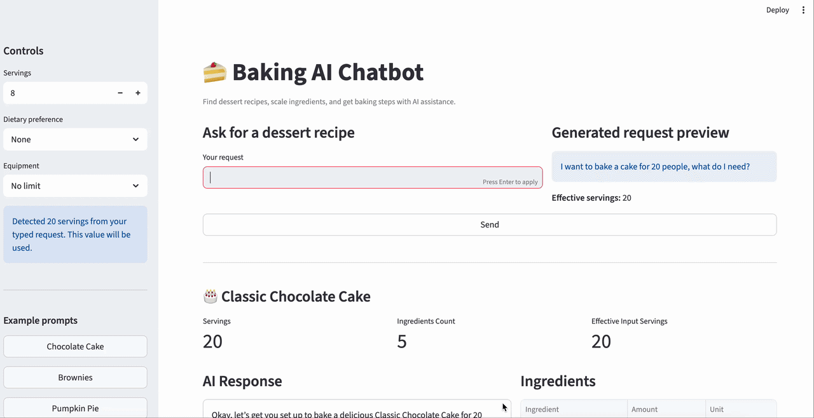

# Baking AI Chatbot

[](./assets/demo3.gif)

Baking AI Chatbot is an AI-powered dessert recipe assistant designed to help users search for recipes, adjust ingredients for different serving sizes, and receive clear baking instructions.
Many recipe chatbots rely too heavily on LLM generation, which can lead to incorrect ingredient amounts or invented steps.
This project improves reliability by:

- **keeping recipes in structured data**
- **performing ingredient scaling with deterministic code**
- **using retrieval before generation**
- **using the LLM only for explanation and natural language presentation**

This makes the system more practical for real cooking and baking scenarios.

---

This project uses a hybrid architecture that combines:
- **structured recipe data** as the source of truth
- **deterministic Python logic** for ingredient scaling
- **keyword matching + Chroma vector retrieval** for recipe search
- **Ollama + LangChain** for grounded response generation
- **FastAPI** for backend APIs
- **Streamlit** for the interactive frontend

This design improves reliability by separating calculation logic from language generation, making the chatbot more practical for real baking use cases.

---

## Features

- Natural language dessert recipe requests
- Recipe retrieval with keyword matching and vector search
- Ingredient scaling based on serving size
- Grounded response generation with Ollama + LangChain
- FastAPI backend with API endpoints
- Streamlit frontend for interactive demo
- Unit and integration tests with pytest
- Local-first architecture with Ollama and Chroma

---

## Example Use Cases

Users can ask in both English and Mandarin, for example:

- `I want pumpkin pie for 6 people`
- `Give me a brownie recipe for 12 servings`
- `I want to make tiramisu for 8 people`
- `我要做南瓜派5個人`(Madarin is okay too)
- `我要做20人份的巧克力蛋糕`

The system will:

1. identify the target dessert
2. detect serving size
3. retrieve the most relevant recipe
4. scale ingredient quantities
5. generate a grounded baking response

---

## Tech Stack

### Backend
- Python
- FastAPI

### Frontend
- Streamlit
- Pandas

### AI / LLM
- LangChain
- Ollama
- Gemma / local Ollama model

### Retrieval
- ChromaDB
- Keyword-based retrieval fallback

### Testing
- Pytest
- FastAPI TestClient

---

## System Design

The system follows a hybrid architecture:

1. **Structured recipe data**
   - Recipes are stored in JSON format
   - Each recipe includes ingredients, steps, servings, and optional metadata such as tags, equipment, and allergens

2. **Recipe retrieval**
   - The system first attempts exact or keyword-based matching
   - If no strong match is found, it falls back to Chroma vector search

3. **Deterministic scaling**
   - Ingredient quantities are scaled using Python logic
   - This avoids relying on the LLM for numeric accuracy

4. **Grounded response generation**
   - Retrieved and scaled recipe data is passed into Ollama through LangChain
   - The LLM generates a natural language baking response using recipe data as the source of truth

---

How to Setup
1. Clone the repository
```bash
git clone <https://github.com/Shu682682/Baking_AI_ChatBot.git>
cd Baking-AI-ChatBot
```


2. Create and activate a virtual environment
```bash
python3 -m venv .venv
source .venv/bin/activate
```

3. Install dependencies
```bash
pip install -r requirements.txt
```

4. Install and run Ollama
Make sure Ollama is installed and running locally.
```bash
ollama pull gemma3
ollama pull embeddinggemma
```

---
How to Run
1. Build the Chroma collection
```bash
python -m app.chroma_setup
```

2. Start the FastAPI backend
```bash
uvicorn app.main:app --reload --reload-dir app --reload-dir data
```

3. Start the Streamlit frontend
```bash
streamlit run ui/streamlit_app.py
```


