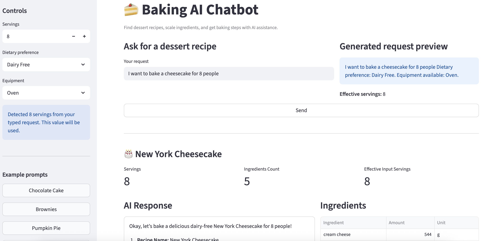

# Baking AI Chatbot

[](./assets/demo3.gif)

Baking AI Chatbot is an AI-powered dessert recipe assistant that helps users search for recipes, adjust ingredients for different serving sizes, estimate calories, and receive clear baking guidance in either English or Traditional Chinese.

Unlike many recipe chatbots that rely too heavily on LLM generation, this project is designed to improve reliability and consistency for real baking scenarios. Instead of letting the model invent ingredient amounts or recipe steps, the system uses structured recipe data as the source of truth and deterministic Python logic for scaling and nutrition calculation.

The chatbot improves practicality by:
- **keeping recipes in structured data**
- **performing ingredient scaling with deterministic code**
- **calculating total calories and calories per serving programmatically**
- **supporting bilingual interaction with language-aware responses**
- **using keyword matching and Chroma vector retrieval before generation**
- **using the LLM mainly for explanation, formatting, and natural language presentation**

This design makes the system more reliable and better suited for real cooking and baking use cases.

---
## Architecture
This project uses a hybrid architecture that combines:
- **structured recipe data** as the source of truth
- **deterministic Python logic** for ingredient scaling
- **deterministic calorie calculation** based on ingredient data
- **keyword matching + Chroma vector retrieval** for recipe search
- **Ollama + LangChain** for grounded response generation
- **FastAPI** for backend APIs
- **Streamlit** for the interactive frontend

By separating calculation and retrieval logic from language generation, the chatbot can provide more accurate recipe quantities, more consistent nutrition estimates, and more reliable multilingual responses.

---

## Features
- Natural language dessert recipe requests
- Bilingual support for English and Traditional Chinese
- Total calorie and per-serving calorie estimation
- Recipe retrieval with keyword matching and vector search
- Ingredient scaling based on serving size
- Grounded response generation with Ollama + LangChain
- Local-first architecture with Ollama and Chroma
- Streamlit frontend for interactive demo
- Unit and integration tests with pytest
- Deterministic recipe logic for improved reliability

---

## Example Use Cases

Users can ask in both English and Mandarin, for example:

- `I want pumpkin pie for 6 people`
- `Give me a brownie recipe for 12 servings`
- `I want to make tiramisu for 8 people`
- `Straberry cake for 3`
- `我要做南瓜派5個人`
- `我要做20人份的巧克力蛋糕`
- `檸檬派15人`

The system will:

1. identify the target dessert
2. detect serving size
3. retrieve the most relevant recipe
4. scale ingredient quantities
5. generate a grounded baking response

---

## Tech Stack

### Backend
- Python
- FastAPI

### Frontend
- Streamlit
- Pandas

### AI / LLM
- LangChain
- Ollama
- Gemma / local Ollama model

### Retrieval
- ChromaDB
- Keyword-based retrieval fallback

### Testing
- Pytest
- FastAPI TestClient

---

## System Design

The system follows a hybrid architecture:

1. **Structured recipe data**
   - Recipes are stored in JSON format
   - Each recipe includes ingredients, steps, servings, and optional metadata such as tags, equipment, and allergens

2. **Recipe retrieval**
   - The system first attempts exact or keyword-based matching
   - If no strong match is found, it falls back to Chroma vector search

3. **Deterministic scaling**
   - Ingredient quantities are scaled using Python logic
   - This avoids relying on the LLM for numeric accuracy

4. **Grounded response generation**
   - Retrieved and scaled recipe data is passed into Ollama through LangChain
   - The LLM generates a natural language baking response using recipe data as the source of truth

---

How to Setup
1. Clone the repository
```bash
git clone <https://github.com/Shu682682/Baking_AI_ChatBot.git>
cd Baking-AI-ChatBot
```


2. Create and activate a virtual environment
```bash
python3 -m venv .venv
source .venv/bin/activate
```

3. Install dependencies
```bash
pip install -r requirements.txt
```

4. Install and run Ollama
Make sure Ollama is installed and running locally.
```bash
ollama pull gemma3
ollama pull embeddinggemma
```

---
How to Run
1. Build the Chroma collection
```bash
python -m app.chroma_setup
```

2. Start the FastAPI backend
```bash
uvicorn app.main:app --reload --reload-dir app --reload-dir data
```

3. Start the Streamlit frontend
```bash
streamlit run ui/streamlit_app.py
```


